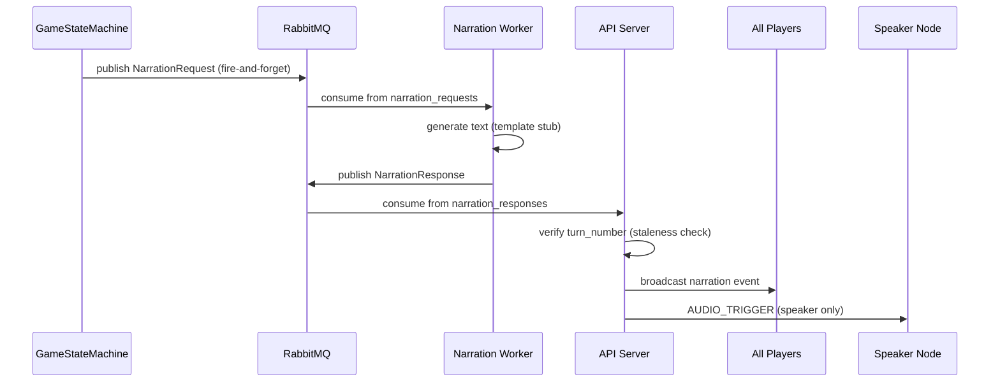

# Phase 4 Walkthrough: AI Narrator Pipeline

## Summary

Implemented the complete AI narration pipeline that decouples slow text/audio generation from the fast game loop via RabbitMQ. The engine publishes narration events fire-and-forget; a standalone worker consumes them, generates text, and publishes responses back; the API server broadcasts narration to all players and sends `AUDIO_TRIGGER` exclusively to the speaker node.

## Files Created

| File | Purpose |
|------|---------|
| [narration.py](file:///Users/rohitagrawal/Desktop/Programming/GameHostAI/app/schemas/narration.py) | [NarrationRequest](file:///Users/rohitagrawal/Desktop/Programming/GameHostAI/app/schemas/narration.py#11-30) / [NarrationResponse](file:///Users/rohitagrawal/Desktop/Programming/GameHostAI/app/schemas/narration.py#32-46) Pydantic models with [turn_number](file:///Users/rohitagrawal/Desktop/Programming/GameHostAI/tests/test_narration.py#277-293) |
| [rabbitmq.py](file:///Users/rohitagrawal/Desktop/Programming/GameHostAI/app/core/rabbitmq.py) | Async RabbitMQ client (aio-pika): connect/close, publish, consume |
| [narration_worker.py](file:///Users/rohitagrawal/Desktop/Programming/GameHostAI/app/workers/narration_worker.py) | Standalone worker with template stubs, `prefetch_count=1`, fallback handling |
| [test_narration.py](file:///Users/rohitagrawal/Desktop/Programming/GameHostAI/tests/test_narration.py) | 23 unit tests for the narration pipeline |

## Files Modified

| File | Changes |
|------|---------|
| [state_machine.py](file:///Users/rohitagrawal/Desktop/Programming/GameHostAI/app/engine/state_machine.py) | Added [turn_number](file:///Users/rohitagrawal/Desktop/Programming/GameHostAI/tests/test_narration.py#277-293), `rabbitmq_publisher`, [_publish_narration()](file:///Users/rohitagrawal/Desktop/Programming/GameHostAI/app/engine/state_machine.py#277-289), [_publish_narration_for_phase()](file:///Users/rohitagrawal/Desktop/Programming/GameHostAI/app/engine/state_machine.py#290-311) |
| [connection_manager.py](file:///Users/rohitagrawal/Desktop/Programming/GameHostAI/app/core/connection_manager.py) | Added [get_speaker_socket(room_id)](file:///Users/rohitagrawal/Desktop/Programming/GameHostAI/app/core/connection_manager.py#49-56) helper |
| [websockets.py](file:///Users/rohitagrawal/Desktop/Programming/GameHostAI/app/api/websockets.py) | Added [handle_narration_response()](file:///Users/rohitagrawal/Desktop/Programming/GameHostAI/app/api/websockets.py#126-172) with staleness check + AUDIO_TRIGGER; wired `rabbitmq_publisher` into game creation |
| [main.py](file:///Users/rohitagrawal/Desktop/Programming/GameHostAI/app/main.py) | RabbitMQ connect/close in lifespan, consumer background task with graceful degradation |

## Data Flow



## Key Design Decisions

- **Fire-and-forget**: `asyncio.create_task` ensures the game loop never blocks on narration
- **Turn-number staleness**: prevents old narration from reaching the wrong phase
- **Graceful degradation**: if RabbitMQ is unavailable at startup, the game engine works fine without narration
- **Worker QoS**: `prefetch_count=1` ensures fair dispatch across multiple workers

## Test Results

```
51 passed in 0.91s ✅
```

All existing Phase 2/3 tests (28) continue to pass alongside the 23 new narration tests.
